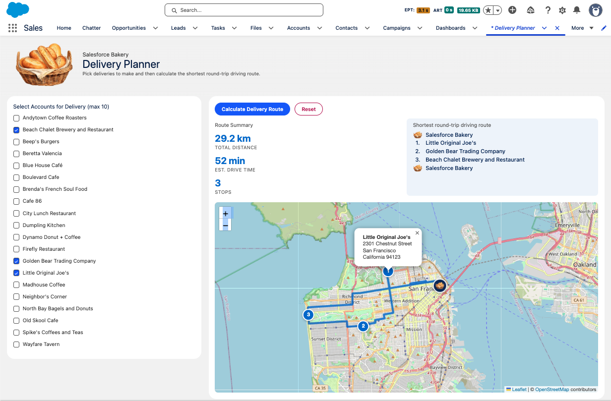

# salesforce-bread-demo
Delivery Planner - a Lightning App Page with LWC.

Select the Accounts to deliver Bread Orders to, then calculate the shortest round-trip delivery route.

Bread data from https://www.finedininglovers.com/explore/articles/15-different-kinds-bread-make

House keeping:
1. `"language": "en_US"` in `config/project-scratch-def.json` will create a scratch org in English
2. If you need to change the org default language to English run the Anonymous Apex script at `scripts/apex/change-language-to-english.apex`
3. ORS API Key is not saved in the repo. Get a new key at: https://openrouteservice.org/dev/#/signup

Setup:
1. In VS Code do `SFDX Push Source to Default Org`
2. Go to Setup > Data > Data Integration Rules and click Geocodes for Account Shipping Address and then Activate 
3. Go to Setup > Security > Named Credentials > External Credentials > OpenRouteService and edit the Principal `ORS_Api_Key`:
    * Add new Authentication Parameter with name: `ApiKey` and value: <<ORS API key>>
4. Assign the Bread Admin Permission Set to your System Admin user
5. Use the Data Import Wizard to map and import Bread records from `scripts/data/Breads.csv`
6. Use the Data Import Wizard to map and import Account records from `scripts/data/Accounts.csv`
7. Run the Anonymous Apex script at `scripts/apex/add-bread-record-image.apex` to add images of breads
 

